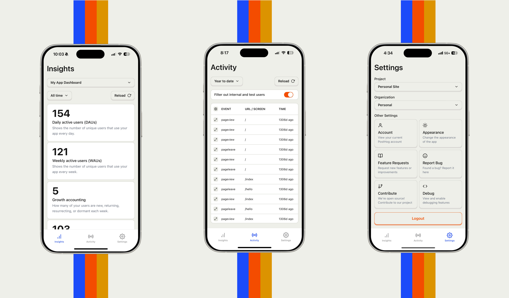

# 🦔 HogLite

## The best way to view your PostHog analytics on the go!




## Introduction

HogLite is a free and open-source [PostHog](https://posthog.com) client for mobile devices. The app allows users to view their PostHog dashboards, events, and more. This repository contains the code for the HogLite app. The app does not have a custom backend, but rather, directly communicates with [PostHog's](https://posthog.com/) API.

## Documentation Sections

- [Introduction](#introduction)
- [Setting up the environment](#setting-up-the-environment)
- [Running the application](#running-the-application)
- [Architecture](#architecture)
  - [Managing Server State](#managing-server-state)
  - [Managing Client State](#managing-client-state)
- [Debugging](#debugging)

## Setting up the environment

1. Install the required packages by running the following command:

```bash
yarn install
```

## Running the application

Run the following command to start the application in development mode:

```bash
yarn dev
```

## Architecture

| Folder       | Description                                                                                                                    |
| ------------ | ------------------------------------------------------------------------------------------------------------------------------ |
| `@types`     | Common data types used across the entire application.                                                                          |
| `api`        | All methods to call PostHog's backend API exist here.                                                                          |
| `app`        | Expo router root folder.                                                                                                       |
| `components` | Larger components made up of smaller components from the `ui` folder, such as Widgets, Bottom Sheets, etc.                     |
| `constants`  | Constant values used across the entire application.                                                                            |
| `hooks`      | Common hooks across the application. Includes an `api` folder with hooks for every API query and mutation using Tanstack Query |
| `lib`        | Utility functions and external library setup.                                                                                  |
| `providers`  | Context providers for the application.                                                                                         |
| `store`      | Client-side stores using Zustand. _Preferred over using React Context_                                                         |
| `ui`         | Small blocks of UI components such as Buttons, Inputs, etc.                                                                    |

### Managing Server State

All async state should be handled via Tanstack Query. Every API query and mutation has an associated hook in the `hooks/api` folder. The hooks should be used in the components to fetch and mutate data. The hooks are responsible for managing the state and fetching the data from PostHog's backend.

Relevant optimistic updates or cache updates (when mutating data) should be handled in the hooks.

Every component using a query should validate `isLoading`, `isError`, and `data` states to handle the UI accordingly.

### Managing Client State

All client state is stored in two unique Zustand stores: `auth-store` (`useAuthStore`) and `client-store` (`useClientStore`). The `auth-store` is responsible for managing the user's authentication state, while the `client-store` is responsible for managing the client's preferences, settings, and state.

Both stores persist their data and rehydrate it on app startup. All persisted client state should be stored in one of these stores. Do NOT directly access a store's state in a component. Instead, set up a selector to prevent inefficient re-renders. See example below:

```tsx
// DON'T DO THIS
const clientStore = useClientStore();

return <Text>Your theme is: {clientStore.theme}</Text>;
```

```tsx
// INSTEAD, DO THIS
const theme = useClientStore((state) => state.theme);

return <Text>Your theme is: {theme}</Text>;
```

## Debugging

To help with debugging, we've added debugging tools to the application when running in development mode.

- **Network Requests**: To view network requests, press three fingers on the screen to open the network inspector.
